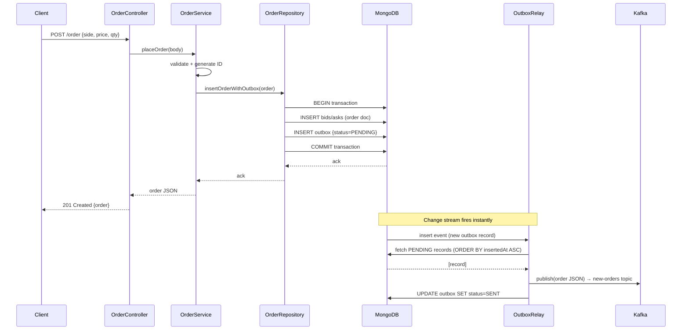

# Order Book — High Level Design & Low Level Design

> Canonical source: https://eudoxus.atlassian.net/wiki/x/AYAH

---

# Part 1 — High Level Design (HLD)

## System Overview

The system is split into three independent services that communicate via Kafka. There is no direct connection between them.

## Architecture Diagram (V2 — Outbox + Change Stream)

```
Client
  │
  │  HTTP (REST)
  ▼
┌──────────────────────────────────────┐
│             order-service            │
│                                      │
│  HTTP Thread(s)                      │
│    POST /order                       │
│      └─ MongoDB transaction ─────────┼──► MongoDB (bids/asks + outbox)
│           order + outbox(PENDING)    │              │
│                                      │    Change Stream fires instantly
│  OutboxRelay thread (background)     │◄─────────────┘
│    watches outbox via change stream  │
│    → publishes PENDING to Kafka      │──► Kafka (new-orders topic)
│    → marks SENT in outbox            │
└──────────────────────────────────────┘
                                              │
                                              ▼
                               ┌──────────────────────────────┐
                               │        matching-engine        │
                               │                               │
                               │  Startup: seed from MongoDB   │◄── MongoDB (bids/asks)
                               │  Post-seed sweep: match()     │
                               │  Poll loop: consume           │
                               │  → deduplicate via Redis      │◄──► Redis (SET NX PX)
                               │  → match in-memory book       │
                               │  → persist trade (txn)        │──► MongoDB (trades)
                               │  → publish trade              │──► Kafka (trades topic)
                               │  → commit offset              │
                               └──────────────────────────────┘
                                              │
                                              ▼
                               ┌──────────────────────────┐
                               │    notification-service   │
                               │                           │
                               │  Consumes trades topic    │
                               │  → sends email per trade  │──► Gmail (SMTP)
                               └──────────────────────────┘
```

## Components

| Component | Responsibility |
| --- | --- |
| **order-service** | Exposes REST API, validates orders, atomically writes order + outbox record to MongoDB, background OutboxRelay thread publishes to Kafka via change stream |
| **matching-engine** | Seeds in-memory book from MongoDB on startup, runs post-seed match sweep to resolve pre-existing crossings, consumes from Kafka, deduplicates via Redis, executes matches with price-time priority, writes trades to MongoDB (transaction), publishes to trades topic |
| **notification-service** | Consumes from trades topic, sends one email per trade via Gmail SMTP |
| **MongoDB** | Durable storage for orders (bids, asks), trades, and outbox records. Runs as single-node replica set (required for transactions and change streams) |
| **Kafka** | Async message bus decoupling all three services. Two topics: new-orders and trades |
| **Redis** | Distributed deduplication cache for matching-engine. Stores seen order IDs with TTL using atomic `SET NX PX`. Matching engine falls back to in-memory cache if Redis is down |

## Data Flow

1. Client places order via `POST /order`
2. order-service validates → atomically writes order + outbox record (status=PENDING) to MongoDB → returns 201
3. MongoDB change stream fires instantly, waking the OutboxRelay background thread
4. OutboxRelay fetches all PENDING records (oldest first), publishes each to `new-orders` topic, marks each SENT
5. matching-engine consumes from `new-orders`, deduplicates via Redis (`SET NX PX`)
6. matching-engine matches against best opposing order using integer price keys
7. On match: atomically writes trade + updates both order statuses to MongoDB, publishes to `trades` topic, commits Kafka offset
8. On no match: order added to in-memory book, Kafka offset committed
9. notification-service consumes from `trades` → sends email with trade details

## Tech Stack Decisions

| Concern | Choice | Reason |
| --- | --- | --- |
| Language | C++17 | Performance, learning goal |
| HTTP | cpp-httplib | Header-only, no Asio dependency |
| Database | MongoDB (replica set) | Flexible document model, transactions + change streams require replica set |
| Messaging | Apache Kafka | Industry standard, durable, replayable |
| Deduplication | Redis 7 | Atomic SET NX PX — survives restarts, works across multiple instances |
| JSON | nlohmann/json | Idiomatic C++, widely used |
| Build | CMake | Standard for C++ projects |
| Email | libcurl + Gmail SMTP | Simple SMTP delivery via app password |

---

# Part 2 — Low Level Design (LLD)

## order-service — Layered Structure

```
main.cpp
  ├── OrderController    ← HTTP layer (routes only, no logic)
  ├── OrderService       ← Business logic (validation, orchestration)
  ├── OrderRepository    ← MongoDB access (atomic transaction: order + outbox)
  └── OutboxRelay        ← Background thread: change stream → Kafka publish
       └── KafkaProducer ← Kafka publishing (used only by OutboxRelay)
```

### OrderController
- Registers HTTP routes: `POST /order`, `GET /orderbook`, `DELETE /order/:id`
- Parses request body, calls service, sets response
- Handles all exceptions and maps them to HTTP status codes
- No business logic

### OrderService
- Validates incoming order fields (side, price, quantity)
- Generates unique order ID and timestamp using thread-local `std::mt19937` (thread-safe, no mutex)
- Calls `repository.insertOrderWithOutbox(order)` — does NOT call KafkaProducer directly

### OrderRepository
- Wraps MongoDB `bids`, `asks`, and `outbox` collections
- `insertOrderWithOutbox(order)` — single MongoDB transaction: inserts order + outbox record (status=PENDING). Both succeed or both roll back.
- `findOpenBids` / `findOpenAsks` — returns OPEN/PARTIALLY_FILLED orders, sorted by price
- `cancelOrder` — sets status to CANCELLED by order ID

### OutboxRelay
- Dedicated background thread; creates its own `mongocxx::client` (mongocxx is not thread-safe across threads)
- **Phase 1 (startup):** drains all existing PENDING outbox records before opening the change stream
- **Phase 2 (steady state):** watches outbox via MongoDB change stream. On each insert event, fetches up to 100 PENDING records oldest-first, publishes to Kafka, marks SENT. Stops batch on first Kafka failure (preserves ordering)

---

## Data Models

### Order Document (MongoDB: bids / asks)

| Field | Type | Description |
| --- | --- | --- |
| `id` | string | Unique order ID (timestamp-ms + random uint32) |
| `side` | string | `BID` or `ASK` |
| `price` | double | Limit price |
| `quantity` | double | Original quantity |
| `remaining` | double | Quantity not yet matched |
| `status` | string | `OPEN`, `PARTIALLY_FILLED`, `FILLED`, `CANCELLED` |
| `timestamp` | int64 | Unix milliseconds — used for time priority |

### Outbox Document (MongoDB: outbox)

| Field | Type | Description |
| --- | --- | --- |
| `id` | string | Same as the order ID |
| `payload` | string | Serialized order JSON |
| `status` | string | `PENDING` or `SENT` |
| `insertedAt` | int64 | Unix milliseconds — relay reads records in this order (ASC) |

### Trade Document (MongoDB: trades)

| Field | Type | Description |
| --- | --- | --- |
| `id` | string | Unique trade ID |
| `bidOrderId` | string | ID of the matched bid |
| `askOrderId` | string | ID of the matched ask |
| `price` | double | Execution price (passive/resting order's price) |
| `quantity` | double | Matched quantity |
| `timestamp` | int64 | Unix milliseconds |

---

## Kafka Topics

| Topic | Message | Producer | Consumer |
| --- | --- | --- | --- |
| `new-orders` | Full order JSON | OutboxRelay (order-service) | matching-engine |
| `trades` | Full trade JSON | matching-engine | notification-service |

---

## Sequence Diagram — Place Order (V2 Outbox)



---

# Part 3 — Matching Engine Design

## Structure

```
main.cpp
  ├── OrderListener       ← Kafka consumer (wraps librdkafka)
  ├── MatchingService     ← Orchestrates: parse → deduplicate → match → persist → publish
  │    └── persistAndPublish()  ← shared by processOrder() and runPostSeedMatch()
  ├── OrderBook           ← In-memory price-time priority book (stateful, single-threaded)
  │    └── RedisDeduplicator ← Redis-backed SET NX PX dedup; in-memory fallback if down
  ├── TradeRepository     ← MongoDB: write trades + update order statuses (transaction)
  └── TradeProducer       ← Kafka: publish trade JSON to trades topic
```

## In-Memory Order Book — Integer Price Keys

Prices are stored as `int64_t` cents internally to prevent floating-point bucketing issues.

```cpp
using PriceKey = int64_t;
static constexpr PriceKey kPriceScale = 100;

PriceKey toPriceKey(double price) {
    return std::llround(price * kPriceScale);
}

std::map<PriceKey, std::deque<Order>, std::greater<PriceKey>> bids_; // highest first
std::map<PriceKey, std::deque<Order>>                         asks_; // lowest first
```

Within each price level, orders sit in a `std::deque<Order>` — append at back (`push_back`), consume from front (`pop_front`). Natural FIFO (time priority) within a level.

## Deduplication — Redis-Backed with In-Memory Fallback

```
tryMarkSeen(orderId):
    Redis: SET "order_dedupe:<id>" 1 NX PX <ttlMs>
      → "+OK"  = first time seen → process
      → "$-1"  = already exists  → skip (duplicate)
```

If Redis is down, falls back to an in-memory eviction cache with identical TTL (24h) and max-size (1,000,000) logic.

| Scenario | Handler |
| --- | --- |
| Redis up | `RedisDeduplicator::tryMarkSeen` → `SET NX PX` |
| Redis down | In-memory eviction cache (fallback) |
| Redis disabled (nullptr) | `OrderBook::knownIds_` map |
| Order seeded from MongoDB on startup | `loadOrder()` marks ID before Kafka consumer starts |

## Startup Seeding & Post-Seed Match Sweep

### Startup sequence (main.cpp)

```cpp
// 1. Pre-warm Redis with recent order IDs (any status) — skip Kafka replays
repo.findOrderIdsSince(nowMs() - ttlMs);
for (id : recentIds) dedup->tryMarkSeen(id);

// 2. Seed open orders into the book (no matching)
auto openOrders = repo.findOpenOrders();    // sorted timestamp ASC → preserves time priority
for (order : openOrders) book.loadOrder(order);  // marks ID in Redis + pushes to bids_/asks_

// 3. Post-seed match sweep — resolve pre-existing crossings from a crash
service.runPostSeedMatch();

// 4. Start Kafka consumer
listener.poll(...);
```

### Why the post-seed sweep is needed — crash-mid-match scenario

Consider a bid that generates 3 trades. The engine crashes after trade 3's MongoDB txn commits but before the Kafka offset is committed:

```
poll bid → Redis SET NX PX ✓ → match() → [Result1, Result2, Result3]
  Result1: MongoDB txn ✓ → Kafka publish ✓
  Result2: MongoDB txn ✓ → Kafka publish ✓
  Result3: MongoDB txn ✓ → CRASH  ← offset never committed
```

On restart, Kafka redelivers the bid. But Redis still has the bid's key → `SET NX PX` returns `$-1` → **bid is skipped entirely**. Trade 3 is never created, and `ask3` remains `OPEN` in MongoDB.

After seeding, `bid` (PARTIALLY_FILLED) and `ask3` (OPEN) are both loaded into the book at crossing prices. `loadOrder()` does **not** run `match()`, so without the sweep the crossing sits until the next Kafka message arrives — and if no new orders come in, trade 3 never executes.

### The fix — `runPostSeedMatch()`

```cpp
// OrderBook — public method that exposes the private match() for the sweep
std::vector<MatchResult> OrderBook::runPostSeedMatch() {
    return match();   // no addOrder() — orders are already in the book
}

// MatchingService — calls the sweep then persists/publishes any results
void MatchingService::runPostSeedMatch() {
    auto results = book_.runPostSeedMatch();
    if (!results.empty()) persistAndPublish(results);
}

// MatchingService — extracted private helper shared by processOrder() and runPostSeedMatch()
void MatchingService::persistAndPublish(const std::vector<MatchResult>& results) {
    auto session = client_.start_session();
    for (const auto& result : results) {
        session.start_transaction();
        repo_.insertTrade(session, result.trade);
        repo_.updateOrderStatus(session, result.bid.id, result.bid.statusToString(), result.bid.remaining);
        repo_.updateOrderStatus(session, result.ask.id, result.ask.statusToString(), result.ask.remaining);
        session.commit_transaction();
        producer_.publish(result.trade.toJson().dump());
    }
}
```

`runPostSeedMatch()` calls `match()` directly — bypassing `addOrder()` intentionally. Orders are already in the book (inserted by `loadOrder()`), so no deduplication check or insertion is needed.

**Why not `addOrder()`?** Seeded order IDs are already registered in Redis by `loadOrder()`. Calling `addOrder()` would flag them as duplicates and return early — doing nothing.

### Failure modes resolved

| Scenario | Before | After |
| --- | --- | --- |
| Crash after last txn, no new orders arrive | Crossing sits indefinitely, trade never executes | Resolved on startup by sweep |
| Crash after last txn, new order arrives later | Trade delayed until next message | Resolved on startup (proactively) |
| No crossings after seeding | n/a | `runPostSeedMatch()` returns empty → no-op |

### Idempotency of the sweep

If the sweep itself crashes mid-way, surviving resting orders remain `OPEN`/`PARTIALLY_FILLED` in MongoDB. On the next restart they are re-seeded with correct `remaining` values and the sweep re-runs. Already-committed trades are not duplicated because those order statuses were already updated in MongoDB.

## Match Algorithm (Price-Time Priority)

```
addOrder(incoming):
  if !tryMarkOrderIdSeen(id): return {}   ← duplicate, skip
  insert into bids_[toPriceKey(price)] or asks_[toPriceKey(price)]
  return match()

match():
  loop:
    bestBidKey = bids_.begin()->first     ← largest int64 = highest price
    bestAskKey = asks_.begin()->first     ← smallest int64 = lowest price
    if bestBidKey < bestAskKey: break     ← no crossing, stop

    fill_qty = min(bid.remaining, ask.remaining)
    trade.price = fromPriceKey(bestAskKey)  ← passive (resting) order's price

    update bid.remaining, ask.remaining, statuses
    pop filled orders; erase empty price levels
    record MatchResult { trade, bid_snapshot, ask_snapshot }
    loop again
```

Execution price = passive order's price. Crossing check compares `int64_t` — no float ambiguity.

## Partial Fill Handling

If a bid of qty=10 matches an ask of qty=4:
- Trade executes for qty=4
- Ask is FILLED and removed from book
- Bid becomes PARTIALLY_FILLED with remaining=6, stays at front of its price level
- Match loop continues — the same bid can fill the next ask

## Trade Persistence — MongoDB Transaction

`persistAndPublish()` wraps the 3 MongoDB writes per trade in a single transaction:

```cpp
session.start_transaction();
repo_.insertTrade(session, trade);
repo_.updateOrderStatus(session, bid.id, bid.status, bid.remaining);
repo_.updateOrderStatus(session, ask.id, ask.status, ask.remaining);
session.commit_transaction();   // all succeed or none visible
producer_.publish(tradeJson);
```

Used by both `processOrder()` (normal Kafka path) and `runPostSeedMatch()` (startup sweep).

## Kafka Consumer — Manual Offset Commit

```
while running:
    poll(500ms) → one message
    service.processOrder(msg)
        → parse JSON
        → tryMarkOrderIdSeen (Redis SET NX PX)
        → addOrder() → match()
        → persistAndPublish(results)
    commit offset   ← only after all steps succeed
```

At-least-once delivery + Redis idempotency = no double trades.

---

# Part 4 — notification-service Design

## Structure

```
main.cpp
  ├── TradeListener        ← Kafka consumer (librdkafka, trades topic)
  ├── NotificationService  ← Parses trade JSON, formats email body
  └── EmailHelper          ← Sends email via Gmail SMTP (libcurl)
```

## Configuration (Environment Variables)

| Variable | Default | Description |
| --- | --- | --- |
| `KAFKA_BROKERS` | `localhost:9092` | Kafka broker address |
| `KAFKA_TRADES_TOPIC` | `trades` | Topic to consume from |
| `KAFKA_GROUP_ID` | `notification-service-group` | Consumer group |
| `GMAIL_USER` | _(required)_ | Gmail address used to send |
| `GMAIL_APP_PASSWORD` | _(required)_ | Gmail App Password |
| `NOTIFY_EMAIL` | _(required)_ | Recipient email address |

## Email Format

```
Subject: Trade Executed — {trade.id}

A trade has been executed on your order book.

Trade Details
=============
Trade ID   : {trade.id}
Price      : {trade.price}
Quantity   : {trade.quantity}
Bid Order  : {trade.bidOrderId}
Ask Order  : {trade.askOrderId}
Timestamp  : {YYYY-MM-DDTHH:MM:SSZ}
```

---

# Part 5 — Design Decisions & Rationale

## 5.1 — Threading Model

**order-service:** `cpp-httplib` thread pool handles each HTTP request on its own thread. Thread-local `std::mt19937` for ID generation (no mutex). OutboxRelay owns its own `mongocxx::client` (mongocxx is not thread-safe across threads).

**matching-engine:** Single-threaded hot path. One Kafka partition → total order → no locks needed for the match loop. Preserves price-time priority naturally.

## 5.2 — Dual-Write Problem (V1 → V2)

V1 wrote to MongoDB then Kafka sequentially — a crash between the two left orders stuck forever. V2 uses the Transactional Outbox Pattern: order + outbox record written atomically in one MongoDB transaction. OutboxRelay publishes in strict `insertedAt ASC` order.

| Property | V1 | V2 |
| --- | --- | --- |
| Atomicity | No — two separate writes | Yes — single MongoDB transaction |
| Kafka ordering | Non-deterministic | Deterministic — relay reads by insertedAt ASC |
| Kafka failure handling | Order lost forever | Record stays PENDING, relay retries |
| Delivery guarantee | At-most-once | At-least-once |

## 5.3 — Transactional Outbox Pattern

**Why stop relay batch on first Kafka failure:** if record 36 fails and the relay skips to 37, the matching engine receives 37 before 36. Order 37 might match what order 36 was supposed to match first — violating price-time priority. Stopping at the first failure preserves strict ordering.

## 5.4 — At-Least-Once Delivery & Idempotency

Outbox → at-least-once to Kafka. Redis `SET NX PX` on the matching engine → idempotent consumption. Together: every order is matched exactly once.

## 5.5 — Redis Deduplication Design

| Property | `unordered_set` | Redis `SET NX PX` |
| --- | --- | --- |
| Survives process restart | No | Yes |
| Works across multiple instances | No | Yes |
| Memory bounded | No | Yes (TTL auto-expires) |
| Extra dependency | No | Yes — Redis process required |

`SET key value NX PX ttlMs` is a single atomic command — set only if Not eXist, expire after milliseconds. No Lua scripts, no WATCH/MULTI/EXEC needed.

`allkeys-lru` eviction policy: under memory pressure, oldest dedupe keys are evicted first. Small duplicate-slip window, covered by in-memory fallback.

## 5.6 — Post-Seed Match Sweep (Crash-Mid-Match Recovery)

### The gap

`loadOrder()` intentionally skips matching — necessary to avoid reprocessing already-handled orders. But any orders at **crossing prices** in MongoDB after a crash are left unmatched until the next Kafka message. If the system is quiet, crossings persist indefinitely.

### The fix

One `match()` sweep runs at startup after all open orders are seeded, before the Kafka consumer starts. Minimal change: doesn't touch seeding, deduplication, or the normal Kafka path.

### Why not `addOrder()`?

`addOrder()` checks deduplication first. Seeded IDs are already registered in Redis by `loadOrder()` → they'd be flagged as duplicates → skipped. The sweep must call `match()` directly.

### Idempotency

Safe to re-run on repeated crashes. Surviving resting orders are re-seeded with correct `remaining` values. Already-committed trades are not duplicated — those order statuses already reflect the fills.
