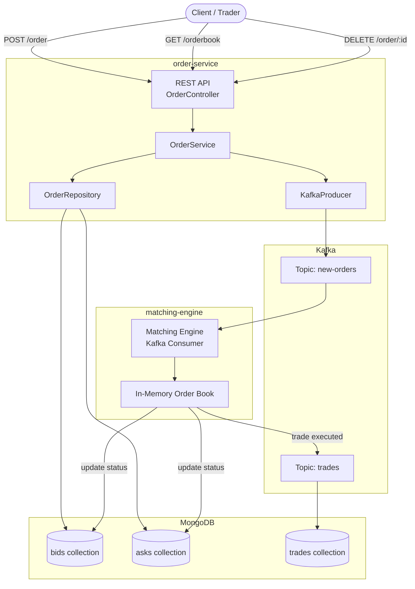
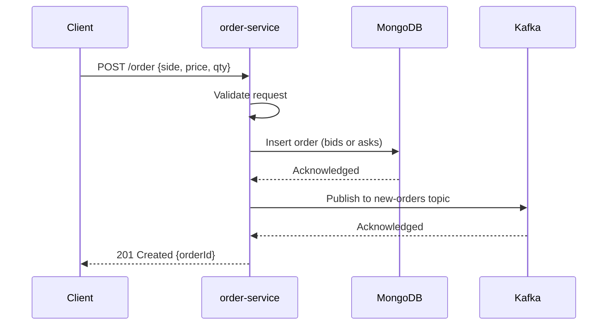
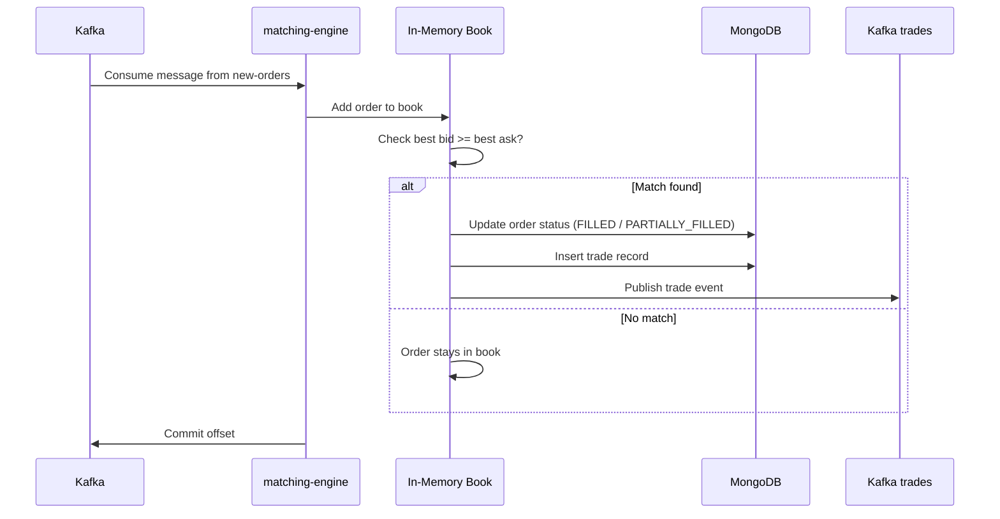
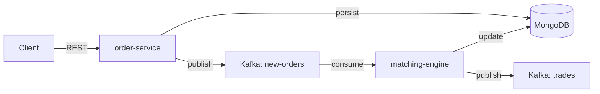
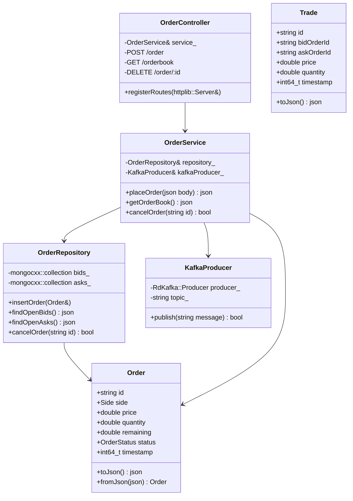
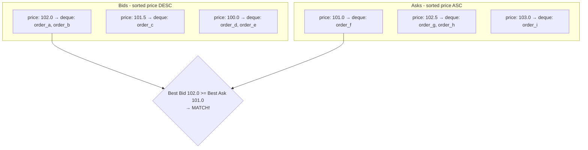
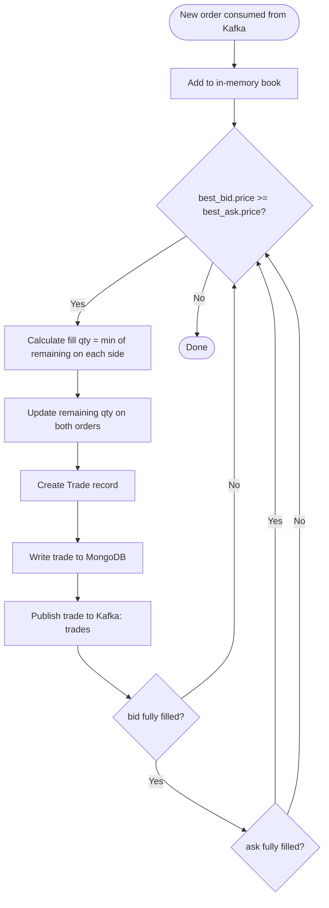

# Order Book System — High Level Design & Low Level Design

---

# Part 1 — High Level Design (HLD)

## System Overview

The system is split into two independent services that communicate via Kafka:

1. **order-service** — REST API, accepts and persists orders
2. **matching-engine** — Kafka consumer, matches orders, records trades

---

## Architecture Diagram



---

## Order Placement Flow



---

## Order Matching Flow



---

## Data Flow Summary



---

## Key Design Decisions

| Decision | Choice | Reason |
|---|---|---|
| Async matching | Kafka | Decouples API from matching logic; orders not lost on crash |
| Separate bid/ask collections | Yes | Different sort orders; cleaner queries |
| In-memory order book | Yes | O(log n) matching; rebuilt from MongoDB on crash |
| Single Kafka partition | Yes | Guarantees ordering of messages (V1 simplicity) |
| Config via env vars | Yes | 12-factor app, no secrets in code |

---

## Component Responsibilities

| Component | Responsibility |
|---|---|
| OrderController | HTTP routing, request/response formatting |
| OrderService | Business logic, validation, orchestration |
| OrderRepository | MongoDB CRUD operations |
| KafkaProducer | Publish order events to Kafka |
| matching-engine | Consume orders, match, persist trades |

---

# Part 2 — Low Level Design (LLD)

## order-service Internal Structure



---

## MongoDB Schema

### bids / asks collections
```json
{
  "_id":       "ObjectId",
  "id":        "1775248390193-3222866137",
  "price":     100.5,
  "quantity":  10,
  "remaining": 10,
  "status":    "OPEN",
  "timestamp": 1775248390193
}
```

### trades collection
```json
{
  "_id":        "ObjectId",
  "id":         "trade-abc123",
  "bidOrderId": "1775248390193-3222866137",
  "askOrderId": "1775248271288-643784549",
  "price":      100.5,
  "quantity":   5,
  "timestamp":  1775248400000
}
```

---

## In-Memory Order Book Structure (matching-engine)



### C++ Data Structure
```cpp
// Bids: highest price first
map<double, deque<Order>, greater<double>> bids;

// Asks: lowest price first
map<double, deque<Order>> asks;
```

---

## Matching Algorithm



---

## API Contracts

### POST /order
**Request:**
```json
{ "side": "BID", "price": 100.5, "quantity": 10 }
```
**Response 201:**
```json
{
  "id": "1775248390193-3222866137",
  "side": "BID",
  "price": 100.5,
  "quantity": 10,
  "remaining": 10,
  "status": "OPEN",
  "timestamp": 1775248390193
}
```

### GET /orderbook
**Response 200:**
```json
{
  "bids": [{ "id": "...", "price": 101.0, "quantity": 10, "remaining": 10, "status": "OPEN", "timestamp": 123 }],
  "asks": [{ "id": "...", "price": 102.0, "quantity": 5,  "remaining": 5,  "status": "OPEN", "timestamp": 456 }]
}
```

### DELETE /order/:id
**Response 200:** `{ "message": "Order cancelled" }`
**Response 404:** `{ "error": "Order not found" }`

---

## Kafka Message Formats

### new-orders topic
```json
{ "id": "...", "side": "ASK", "price": 101.0, "quantity": 5, "remaining": 5, "status": "OPEN", "timestamp": 1775248390193 }
```

### trades topic
```json
{ "id": "trade-abc123", "bidOrderId": "...", "askOrderId": "...", "price": 100.5, "quantity": 5, "timestamp": 1775248400000 }
```

---

## Error Handling

| Layer | Error | HTTP Response |
|---|---|---|
| Controller | Invalid JSON | 400 Bad Request |
| Controller | Missing fields | 400 Bad Request |
| Service | Validation failure | 400 Bad Request |
| Service | DB insert failed | 500 Internal Server Error |
| Service | Kafka publish failed | 500 Internal Server Error |
| Controller | Order not found (cancel) | 404 Not Found |

---

# Part 3 — Matching Engine Design

*This section will be completed once the matching engine implementation is done.*

Topics to be documented here:
- Kafka consumer setup and offset management
- Crash recovery / state rebuild from MongoDB
- Concurrency model
